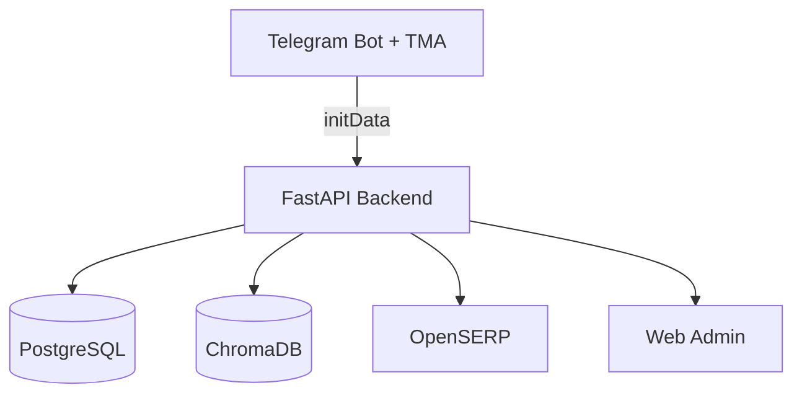

# INFRA

INFRA — система мониторинга сигналов с разделением **Great Divide**: Web‑интерфейс доступен только администраторам, а клиентский продукт живёт в Telegram Bot и Telegram Mini App (TMA).

## Архитектура



## Локальный quickstart

```bash
cd backend
python -m venv .venv
source .venv/bin/activate
pip install -r requirements.txt
export PYTHONPATH=/app
uvicorn app.main:app --reload
```

## Docker compose quickstart

```bash
cp .env.example .env
docker compose build
docker compose up -d
```

## Переменные окружения

См. `.env.example`.

## Alembic миграции

```bash
cd backend
alembic upgrade head
alembic revision --autogenerate -m "описание"
```

## Запуск бота

```bash
cd backend
python -m app.bot
```

## Деплой на VPS

См. `docs/runbook_vps.md`.

## Документация

- `docs/overview.md`
- `docs/architecture.md`
- `docs/api_public.md`
- `docs/api_admin.md`
- `docs/security.md`
- `docs/sentinel.md`
- `docs/runbook_vps.md`
